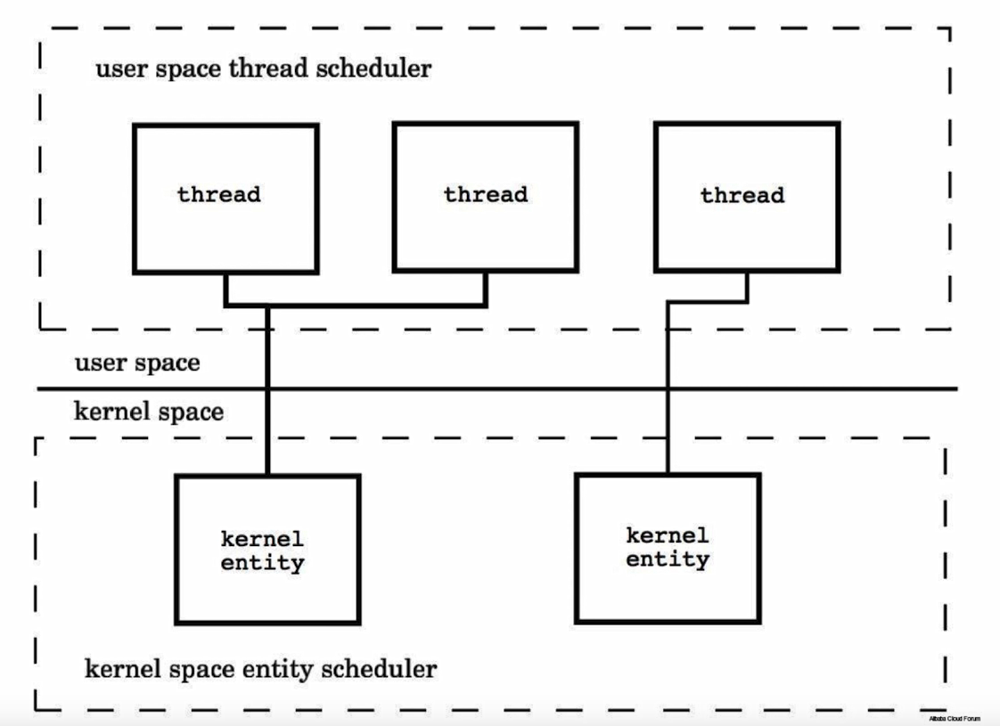
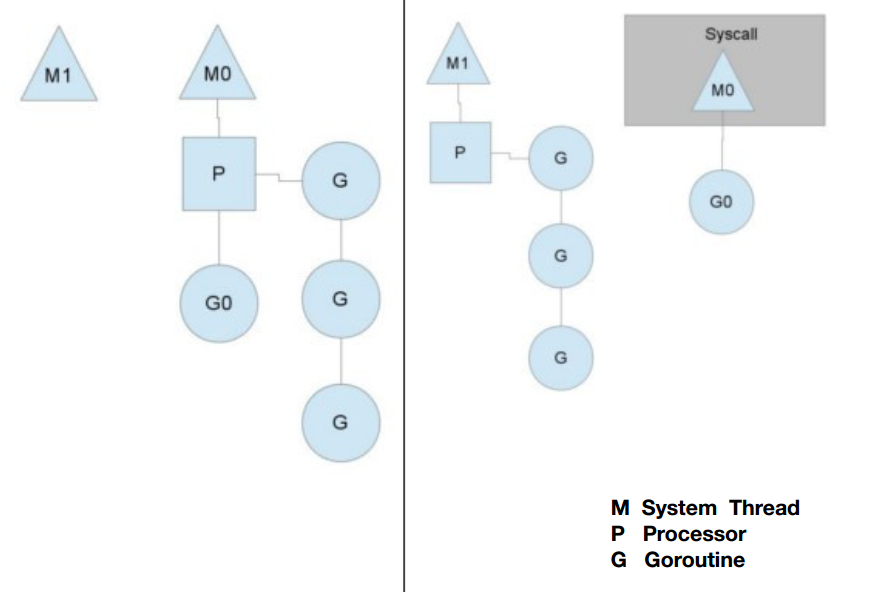

## 23 协程机制

### Thread vs Groutine (协程)
1. 创建时默认的stack的大小
    * JDK5 以后 Java Thread stack 默认为1M
    * Groutine 的 Stack 初始化大小为 2K
2. 和 KSE (Kernel Space Entity) 的对应关系
    * Java Thread 是 1:1
    * Groutine 是 M:N
    

### Go 的协程调度
* 名词解释
    * M 系统线程
    * P Go语言的协程处理器
    * G 协程
* 每一个P对应一个待运行的协程队列
* 当某个协程被系统中断，则P切换到另外的M进行下一个协程的执行
* 当协程被唤醒后，协程随机加入到P中，或加入到全局等待队列中

