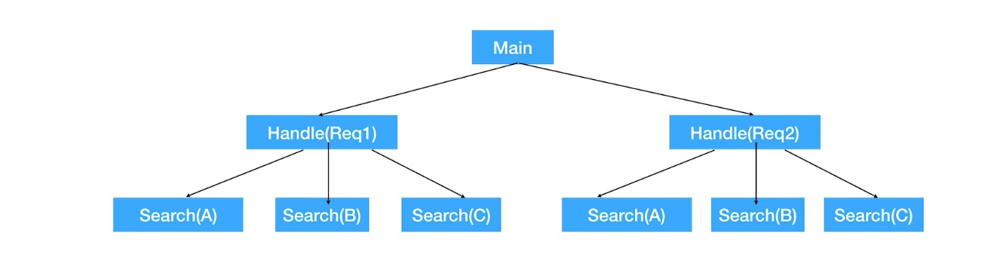

mermaid: true
## 29 Context与任务取消
* 关联任务的取消

#### Context
* 根Context：通过context.Background()创建
* 子Context：context.WithCancel(parentContext)创建
    * ctx, cancel := context.WithCancel(context.Background())
* 当前 Context 被取消时，基于他的子 context 都会被取消
* 接收取消通知 <-ctx.Done()