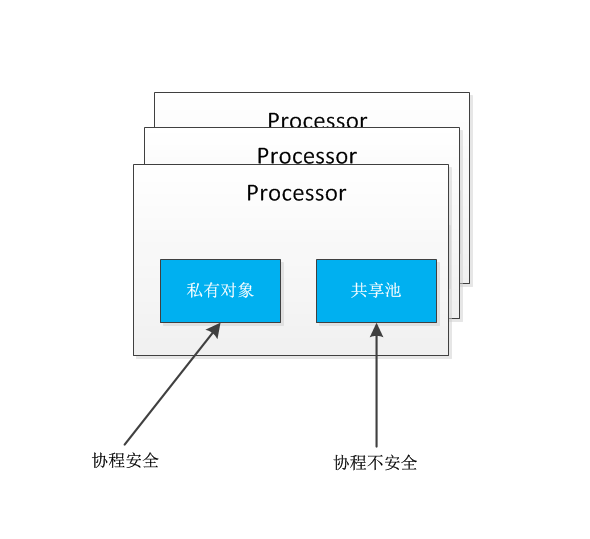

## 34 sync.pool 对象缓存
### sync.Pool 对象获取
* 尝试从私有对象获取
* 私有对象不存在， 尝试从当前Processor的共享池获取
* 如果当前Processor共享池也是空的，那么就尝试去其他Processor的共享池获取
* 如果所有子池都是空的，最后就用用户指定的New函数产生一个新的对象返回



### sync.Pool 对象放回
* 如果私有对象不存在则保存为私有对象
* 如果私有对象存在，放入当前Processor子池的共享池中

### 使用sync.Pool
```go
    pool := &sync.Pool {
    	New: func() interface{} {
    		return 0
    	},
    }
    arry := pool.Get().(int)
    ...
    pool.Put(10)
```

### sync.Pool 对象的生命周期
* GC 会清除 sync.pool 缓存的对象
* 对象的缓存有效期为下一次GC之前

### sync.Pool 总结
* 适合于通过复用，降低复杂对象的创建和GC代价
* 协程安全， <font color=red>会有锁的开销</font>
* <font color=red>生命周期受GC影响，不适合于做连接池等，需自己管理生命周期的资源的池化</font>