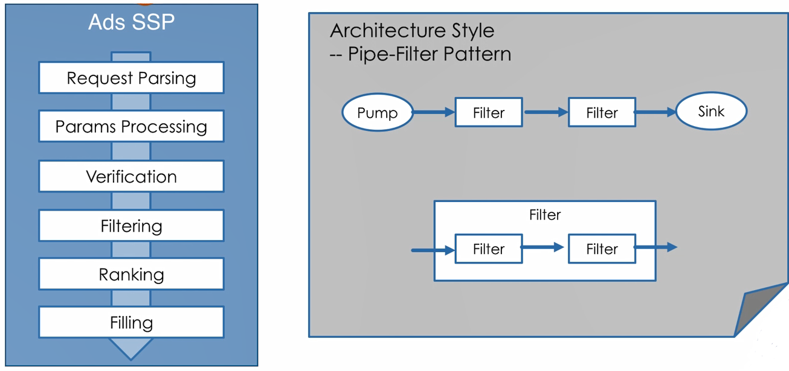
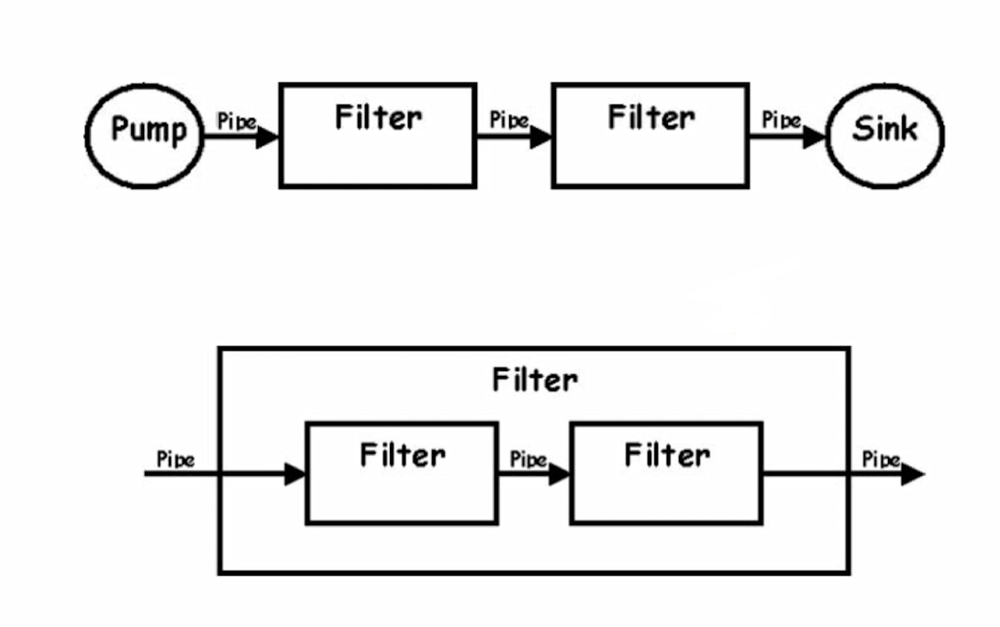
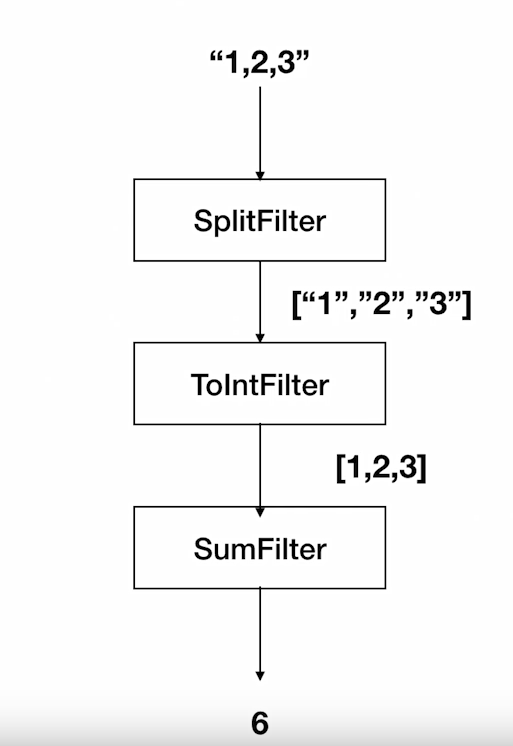

# 41 实现 pipe-filter framework
## 架构模式
 An architectural pattern is a general, reusable solution to a commonly occurring problem in software architecture 
 within a given context.

 -- wikipedia
 
 ## Pipe-Filter 架构
 
 
 * 非常适合于数据处理及数据分析系统
 * Filter 封装数据处理的功能
 * 松耦合：Filter 只跟数据（格式）耦合
 * Pipe 用于连接 Filter 传递数据或者在异步处理过程中缓冲数据流
    * 进程内同步调用时，pipe演变为数据在方法调用间传递
    
## Filter 和组合模式

## 示例
